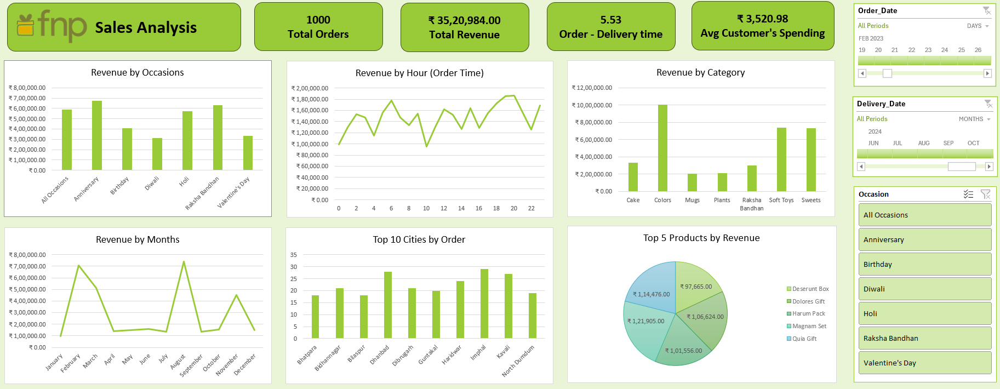
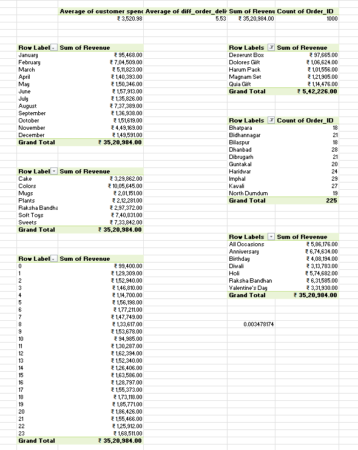

# *🌸 Ferns N Petals Sales Analysis 🌸*
# *📊 Project Overview*

This project analyzes the sales data of Ferns N Petals (FNP) to extract meaningful business insights. FNP is a leading gifting platform specializing in occasions such as Diwali, Raksha Bandhan, Holi, Valentine’s Day, Birthdays, and Anniversaries. The objective of this analysis is to uncover patterns in sales performance, customer behavior, and product trends, enabling smarter business strategies and improved customer satisfaction.

# *🛠 Tools Used*
- Microsoft Excel

# *❓ Key Business Questions Answered*

💰 Total Revenue – What is the overall revenue generated?

⏱ Average Order and Delivery Time – How efficient is the order processing and delivery cycle?

📅 Monthly Sales Performance – How do sales vary across months of 2023?

🔝 Top Products by Revenue – Which products bring in the highest revenue?

🛒 Customer Spending Analysis – How much do customers spend on average?

📈 Sales Performance of Top 5 Products – Which products consistently drive revenue?

🏙 Top 10 Cities by Orders – Which cities contribute most to order volumes?

📦 Order Quantity vs. Delivery Time – Do larger orders affect delivery efficiency?

🎉 Revenue by Occasion – Which occasions generate the most revenue?

🎁 Product Popularity by Occasion – Which products are most popular for each festive occasion?

# *📁 Project Files*

📊 FNP Sales Analysis Dashboard (Excel File) – Includes all KPIs, charts, and visualizations.

📝 Problem Statement (PDF File) – Outlines the objectives and business questions.

📸 Screenshots of Dashboard – Quick reference visuals for insights without opening Excel.

🎤 Project Report (PowerPoint Presentation) – Summarizes the analysis, insights, and recommendations in a presentation format.

# *📸 Dashboard Snapshot*

# *🔍 Insights & Findings*

- Festive Occasions Drive Sales – Revenue peaks during Holi and Raksha Bandhan.

- Top Product Categories – Colors and Soft Toys dominate sales performance.

- Customer Spending – Average order value is ₹3,520.98.

- Geographic Trends – Cities like Imphal, Dhanbad, and Kavali contribute most orders.

- Logistics – Bulk order size does not significantly increase delivery times.

# *🚀 Strategic Recommendations*

- *Boost Occasion Marketing* – Strengthen campaigns around peak events (Anniversary, Raksha Bandhan, Holi) and improve sales during weaker ones like Diwali and Valentine’s Day.  

- *Expand Premium Gift Lines* – Focus on curated hampers and gift sets, as they generate the highest revenue and align with customer preferences.  

- *Target Emerging Cities* – Invest in Tier-2 markets showing growth potential to expand customer reach and increase order volumes.  

Ultimately, this analysis provides a data-driven foundation to strengthen sales strategies, improve inventory planning, and deliver a better customer experience.

# *🔚 Conclusion*

This analysis provides key insights that can help Ferns N Petals optimize its sales strategies, improve inventory management, and enhance customer experience. The findings highlight the importance of seasonal trends, product popularity, and efficient logistics in driving business growth.
